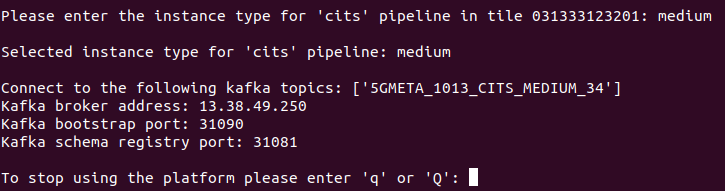

5GMETA platform is an IoT oriented platform that produces data from vehicles to be consumed by third party applications in order to get data from several types:

* CITS
    * json like messages with data extracted from the vehicle (ex: GPS position, etc)
    * [Example](https://github.com/5gmetadmin/5gmeta-dev/tree/main/tools/cits-example.json)
* images
    * jpg
* Video streaming


# Guide to consuming data
Before jumping to consuming the available datatypes, it is necessary to understand some concepts in order to use 5GMETA APIs:

-  **Tiles** : 
  -  ***About Geographic Data Tiles*** :
    Geographic data tiles are a way of organizing and distributing large datasets of geographic information, such as satellite imagery or digital maps. **Each tile represents a specific geographic area**, and the data within each tile is typically organized into a regular grid or matrix. By dividing data into tiles, it becomes easier to manage and distribute large datasets, as users can selectively download only the tiles they need.

  - In this consuming guide file, we provide information about the geographic areas covered by our dataset tiles [Datasets available within tiles](https://github.com/5gmetadmin/5gmeta-dev/blob/main/docs/datasets.md) , along with instructions on how to access and use the data. By using tiles to organize and distribute our data, we aim to make it more accessible and easier to use for a wide range of applications.
-  **Available Datatypes** :
  -  5GMETA Platform provide wide range of datatypes:
    -  ***C-ITS*** : ***Cooperative Intelligent Transport Systems***
      * **JSON** Format, **ETSI CAM**  messages also included (ex: GPS position, speed, etc..)
      * ETSI is the European Telecommunications Standards Institute (Vehicular communication is based on wireless Vehicle-2-Everything (V2X) networks)
      * 
    -  ***Images*** :
      * **JPG** Format
      * 
    -  ***Video Streams***
      * Video Streams are in **H.264** video standard Format (x264 implementation)
-  **Instance Types**:
  -  5GMETA Platform offers a range of computing resources for users to choose from.
  -  Instance types refer to different configurations of computing resources that are available for users to choose from when setting up their virtual machines or cloud computing instances. In this example, we have four different instance types with varying amounts of CPU, GPU, and memory resources:
  1. "***small***" instance type: This instance type has 2 CPUs, 2GB of memory, and no GPU.
  2. "***medium***" instance type: This instance type has 4 CPUs, 4GB of memory, and no GPU.
  3. "***large***" instance type: This instance type has 8 CPUs, 8GB of memory, and no GPU.
  4. "***advanced***" instance type: This instance type has 8 CPUs, 8GB of memory, and a GPU.
  -  The instance types are identified by unique type IDs (type_id) and human-readable names (type_name) to make it easier for users to select the type of instance that best suits their needs.
  -  
## Registering into the application

First step to start using 5GMETA platform will be registering on it.

Please go to [Registration web page](https://5gmeta-platform.eu/identity/realms/5gmeta/login-actions/registration?client_id=apisix&tab_id=gXKk2YPUybg) and fill the form with the data.


Once you have registered you will be able to access the platform and start consuming data. Next you will be guided with some instructions to get that purpouse.

## Software requirements

This guide is oriented to be executed in an Ubuntu 20.04 environment.

## Extra packages to be installed
First of all, you will need to install some dependencies (apt-get):

* python3-avro
* python3-confluent-kafka
* gstreamer1.0-plugins-bad (only if you are going to consume video)
* gstreamer1.0-libav (only if you are going to consume video)
* python3-gst-1.0 (only if you are going to consume video)

Also install with pip3:

* kafka-python
* numpy
* python-qpid-proton
* requests
* confluent-kafka
* avro

Also find easy installation for all the required packages(Be careful of your environment compatibility):

* ```pip3 install -r examples/requirements.txt```


## Platform-client helper application

There is a guided applicaction that will help you to get the apropriate parameters from 5GMETA platform to get the data you need.
You can execute it by downloading all content from folder: 

* [Platform cliente helper application](https://github.com/5gmetadmin/5gmeta-dev/tree/main/utils/platform-client/)

Once you have donwload that software you can run it by executing:
```
$ python3 client.py
```

in your command line.


### Client usage
Once you have executed the previous command you will be prompted for:
* 5GMETA username
* 5GMETA password


After entering your username/password, client will ask you if you want to:
* Consume data from 5GMETA platform
* Produce an event in a vehicle connected to 5GMETA platform


In our case we have decided to consume data, so we push c. 

Inmediately client will show which [tile](#tile) have data.


And will ask you to select one of them to consume data from.


You can stop selecting tiles by pushing q in your keyboard.

After selecting tiles client will show which datatype is available in the tiles you have selected.


And will ask you to select which datatype do you want to consume.


Once selected you will be prompted with the instancetype you can use in the MEC that is managin data from that tile


and will be asked to choose one.

Once selected you will be prompted with the parameters from 5GMETA platform you have to use in consumer examples




Please notice that the parameters showed in that ouput **ARE VALID ONLY IF YOU KEEP client.py RUNNING**, once you stop it by pressing **q** those parameters could not be valid for your consumer application.

**PLEASE DON'T STOP client.py APPLICATION BY PUSHING CTRL-C**


## Consumer examples

5GMETA platform offers some examples to comsume those data.

* [CITS command line consumer](https://github.com/5gmetadmin/5gmeta-dev/tree/main/examples/stream-data-gateway/consumer/cits/cits-consumer.py)
* [image command line consumer](https://github.com/5gmetadmin/5gmeta-dev/tree/main/examples/stream-data-gateway/consumer/image/image-consumer.py)
* [video command line consumer](https://github.com/5gmetadmin/5gmeta-dev/tree/main/examples/stream-data-gateway/consumer/video/video-consumer.py)

Those consumer clients will ask you for the parameters obtained as output in the [Client usage](#client-usage) section.

### CITS consumer

This client is a Kafka client that will consume CITS data from 5GMETA platform and will print on the command line output. It takes as input parameters:

* Kafka topic
* Kafka broker address
* Kafka bootstrap port
* Kafka schema registry port

#### Consumer instructions

- Select the suitable consumer as per the produced data and use as follows: 
```
python3 cits-consumer.py topic platformaddress bootstrap_port registry_port

``` 
or
```
python3 image-consumer.py topic platformaddress bootstrap_port registry_port

``` 
or

```
python3 video-consumer.py platformaddress bootstrap_port topic dataflow_id

```
