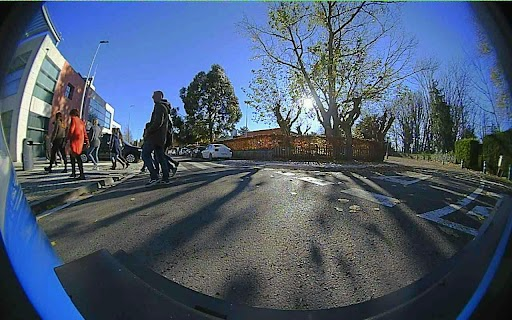
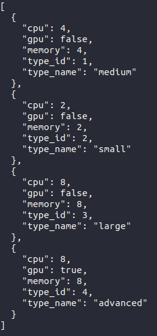

# Getting Started

## Basics Concepts

Considering the 5GMETA platform framework, external users can integrate their assets, either using specific interfaces to produce or consume data, or by providing communication, computing and storage resources to operate the data platform. 
Thus, as a user, you might intend to interetact with the data platform have been identified to perform one of the following actions: 

* Develop data-driven CAM services and applications
* Produce sensors and devices data 
* Provide infrastructure hosting 5GMETA functionnalities

**Data pipelining** between producers and consumers is done using, so called **dataflows**. Thus **dataflows** are the main elements from which data from the sensors and devices can be accessed by the CAM services in a unique relation.

**Data access** can be managed to suite the needs of the data-driven services by the adatpation of the following functionnalities:

-  **Tiles** : 
  -  ***About Geographic Data Tiles*** :
    Geographic data tiles are a way of organizing and distributing large datasets of geographic information, such as satellite imagery or digital maps. **Each tile represents a specific geographic area**, and the data within each tile is typically organized into a regular grid or matrix. By dividing data into tiles, it becomes easier to manage and distribute large datasets, as users can selectively download only the tiles they need.

  - In this consuming guide file, we provide information about the geographic areas covered by our dataset tiles [Datasets available within tiles](https://github.com/5gmetadmin/5gmeta-dev/blob/main/docs/datasets.md) , along with instructions on how to access and use the data. By using tiles to organize and distribute our data, we aim to make it more accessible and easier to use for a wide range of applications.
-  **Available Datatypes** :
  -  5GMETA Platform provide wide range of datatypes:
    -  ***C-ITS*** : ***Cooperative Intelligent Transport Systems***
      * **JSON** Format, **ETSI CAM**  messages also included (ex: GPS position, speed, etc..)
      * ETSI is the European Telecommunications Standards Institute (Vehicular communication is based on wireless Vehicle-2-Everything (V2X) networks)
      * 
    -  ***Images*** :
      * **JPG** Format
      * 
    -  ***Video Streams***
      * Video Streams are in **H.264** video standard Format (x264 implementation)
-  **Instance Types**:
  -  5GMETA Platform offers a range of computing resources for users to choose from.
  -  Instance types refer to different configurations of computing resources that are available for users to choose from when setting up their virtual machines or cloud computing instances. In this example, we have four different instance types with varying amounts of CPU, GPU, and memory resources:
  1. "***small***" instance type: This instance type has 2 CPUs, 2GB of memory, and no GPU.
  2. "***medium***" instance type: This instance type has 4 CPUs, 4GB of memory, and no GPU.
  3. "***large***" instance type: This instance type has 8 CPUs, 8GB of memory, and no GPU.
  4. "***advanced***" instance type: This instance type has 8 CPUs, 8GB of memory, and a GPU.
  -  The instance types are identified by unique type IDs (type_id) and human-readable names (type_name) to make it easier for users to select the type of instance that best suits their needs.
  -  

## Requirements for interfacing your application

### Software requirements

* Ubuntu, preferrably 20.04
* python3

### Registering into the application

First step to start using 5GMETA platform will be registering on it.

Please go to [Registration web page](https://5gmeta-platform.eu/identity/realms/5gmeta/protocol/openid-connect/auth?client_id=account-console&redirect_uri=https%3A%2F%2F5gmeta-platform.eu%2Fidentity%2Frealms%2F5gmeta%2Faccount%2F%23%2F&state=e663b644-ad9e-4099-8ef5-a01f0b96113b&response_mode=fragment&response_type=code&scope=openid&nonce=8fe4af95-2960-4091-8291-f0b938ecb71b&code_challenge=q1YJn1i-HV4Bk695CxlzYXIrLedunlS7TBafxCULGCQ&code_challenge_method=S256) and fill the form with the data.

Once you have registered you will be able to access the platform and start consuming data. Next you will be guided with some instructions to get that purpouse.

### Extra packages to be installed
First of all, you will need to install some dependencies (apt-get):

* python3-avro
* python3-confluent-kafka
* gstreamer1.0-plugins-bad (only if you are going to consume video)
* gstreamer1.0-libav (only if you are going to consume video)
* python3-gst-1.0 (only if you are going to consume video)

Also install with pip3:

* kafka-python
* numpy
* python-qpid-proton
