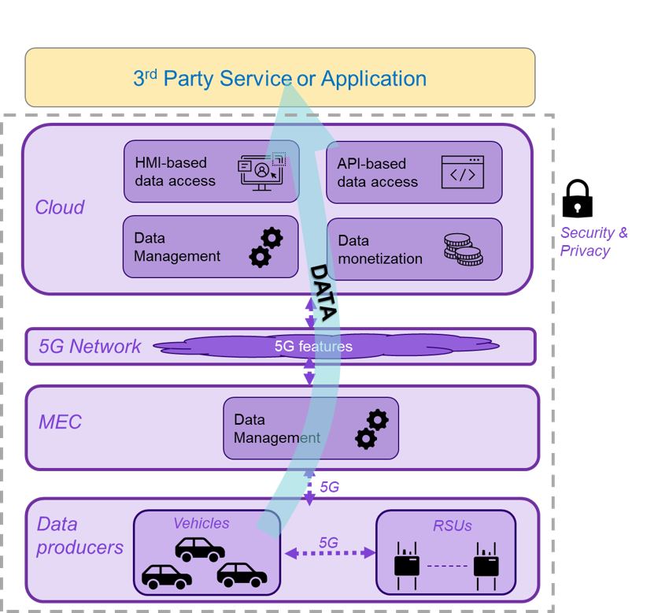

# 5GMETA Platform User Documentation

## What is the 5GMETA platform?
5GMETA is an open data-centric Internet of Things (IoT) messaging platform for Connected and Automated Mobility (CAM) services and applications.

5GMETA live ingest where the security, privacy, scalability, interoperability and licensing features are provided by the 5G networks functions executed at the edge to gain near-to-zero latency, capillarity and geo-driven networking.

## What does the 5GMETA platform do?

5GMETA Platform gives access to Third Parties to vehicle and road infrastructure data.
It can be seen as a meeting-point between CAM data producers and consumers. 
It allows the data producers (vehicles and RSUs) to post data from their data sources (e.g. sensors, camera) so that the data consumers can consume them in streaming mode in order to create data-driven innovative services for their clients. 
Streaming mode means that the 5GMETA platform doesn’t store data.

## Table of Contents
In the next topics we will cover the following topics:

* Getting started
* Consuming Guide
* Dataset Guide
* Producing Events Guide
* Data Processing Tutorials
