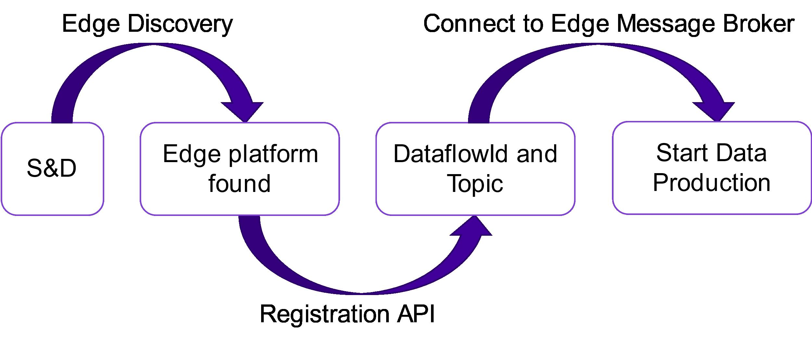
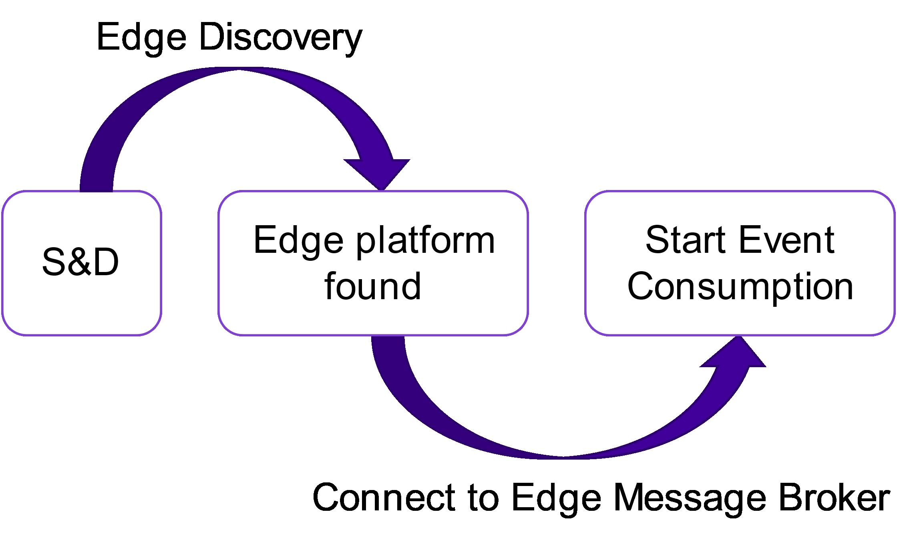

# Data Producer and Consumer User Guide

## Introduction
This documentation introduces the APIs needed to be able to produce and consume various types of user data to the 5GMETA platform. 

## Background

### 5GMETA Platform Framework
The 5GMETA platform can be seen as a meeting-point between CAM data producers and consumers. It allows the data producers to post data from their data sources (e.g. sensors, camera) so that the data consumers can consume them in streaming mode in order to create data-driven innovative services for their clients. Streaming mode means that the 5GMETA platform doesn’t store data.

* The data flow from the data producers called Sensors and Devices, through the 5GMETA platform and towards the data consumers which are CAM Services and Applications that rely on CAM data. 
* The Sensors and Devices (S&D) represent the data producers with their data sources generating the data that are sent to the platform. The data sources can be vehicle’s sensors, cameras etc. They communicate with the 5GMETA platform using 5G network.
* The CAM Services and Applications act as data consumers accessing the data that are made available through the platform.
* The 5GMETA MEC acts as an intermediate between the Sensors and Devices and the cloud layer. It can be seen as a part of the 5GMETA platform that is deployed close to where the data are produced. Its purpose it to serve the data producers in its vicinity.

### APIs Description

As seen in the high-level platform architecture above, following are some APIs in the Cloud and the MEC layers which are important to know for producing and consuming data.

Cloud layer APIs:

* **Discovery API**: This API allows MEC infrastructures to publish the credentials and metadata including endpoints, coverage and inventories available computing resources to host data pipelines, indexing all the 5GMETA MEC infrastructures data services, the information to be operated by the cloud, according to third-party application/service developer requests, and the configuration to connect to and from Sensors and Devices.
* **Stream Data**: This API makes connections on demand between the cloud platform and the selected MEC platforms from where capture the data according to third-party application/service developer requests, and push all the applicable data samples into the individual topic for the third-party application/service.
* **Dataflow**: The Dataflow API stores the request of any third-party application/service developer request in terms of data and geographic production tiles to trigger through the Registration API the data sending from Sensors and Devices, and to create the individual topic for the third-party application/service.
* **The Data Gateway API**: This provides to a third-party application/service the endpoint and the topic to produce or consume data limiting the access to legitimate and valid third-party systems.

MEC layer APIs:

* **Registration API**: The Registration API is a RESTful application working as main interface of communication with the Sensors & Devices. The S&D should connect to this component before publishing messages to receive the ***DataflowId and Topic*** needed to publish data using the internal Message Broker. This component also should receive a ***Keep Alive*** from the S&D: if the S&D stops sending the Keep alive, the APIs remove its dataflow from the available ones in the platform.
* **The Message Broker**: The Message Broker a broker implementing the publish-subscribe pattern. This broker is then connected to the  ***Stream Data*** in the cloud side of the platform, both to upload data from the S&D to the CAM Services and Applications and to send events from the CAM Services and Applications to the S&D.
* **Video Broker**: The Video Broker is a Proxy for video streams coming from the Sensors and Devices. The supported protocols for the streams are V4L, RTP and RTSP.

## Sensor and Device Interfaces

This section describes different aspects on how Sensors & Devices operate and interact with the 5GMETA platform to connect different data sources with a specific production application or service. The communication interfaces described in this section allow the Sensors & Devices to produce data to the platform and receive events from the Third Parties that are consuming data in the platform.

* **A publish-subscribe protocol**: the Edge Message Broker implements the publish-subscribe paradigm, so to send messages in the platform is mandatory to support the specific protocols supported by this component (such as MQTT or AMQP).
* **Streaming Standards**: Sensors and Devices can produce media streams in RTSP, UDP or WebRTC formats. The data APIs will provide access to WebRTC media streams to CCAM applications.
* **HTTP**: the Registration API and the Discovery API in the Edge provide services as a RESTful application, so HTTP can be used to interface with those 5GMETA components is by means of HTTP requests.

### Data Production Flow

The Data Production allows any S&D to publish data in the platform, to be then consumed by the Third Parties. In order to do that, S&Ds can connect to the APIs exposed by the platform to define and register the dataflows it wants to produce and which MEC infrastructure to connect to depending on their geolocation. This interaction is summarized in figure shown below.

### Event Consumption Flow

The Event Consumption allows S&D to receive messages that were generated by CAM Services and Applications. To do so, the S&D has to subscribe to a specific Topic in the Edge Broker, connected to the Stream of data in which the CAM Services and Applications are publishing the events. This interaction is summarized in figure below.

## CAM Services and Applications Interfaces

The communication interfaces described in this section allow to the CAM Services and Applications to register to the platform, consume data from the platform and generate events that will be received from the Sensors & Devices.

* **A publish-subscribe protocol**: the ***Stream Data*** implements the publish-subscribe paradigm, so to receive messages from the platform is mandatory to support the specific protocols supported by this component (such as KAFKA).
* **HTTP**: The ***Dataflow API, Identity API and cloud Instance API*** provide services in the form of a RESTful application, so the only way to interface with those 5GMETA components is by means of HTTP requests.
* **WebRTC**: Video data from the 5GMETA platform will be sent through the WebRTC protocol. 

### Data Consumption Procedure

The Data Consumption allows a CAM Service and Application to receive data from any of the Sensors and Devices publishing in the platform. To do so, a CAM Service and Application can connect to the APIs exposed by the platform to define the dataflows it wants to consume and which pre-processing pipeline. This interaction is summarized in below.

### Event Generation Procedure

The Event Generation allows a CAM Service and Application to generate events and send them to the Sensors and Devices connected to the platform. To do so, a CAM Service and Application connects to the APIs exposed by the platform to generate messages that will be forwarded through the platform to the Sensors and Devices. This interaction is summarized in the figure below.

## Table of Contents
In the next topics we will cover the following APIs and examples:

* [Message Data Broker API](https://github.com/5gmetadmin/message-data-broker) - Stream the messages from sensors and devices to the 5G MECs.
* ActiveMQ Producer and Consumer [examples](https://github.com/5gmetadmin/message-data-broker/tree/main/examples/activemq_clients).
* [Stream Data Gateway API](https://github.com/5gmetadmin/stream-data-gateway) - Stream messages from the MECs to the Third Parties.
* [5GMETA Platform Client](https://github.com/5gmetadmin/stream-data-gateway/blob/main/utils/platform-client/client.py) - Third party Python client for making requests to 5GMETA Platform. 
* Kafka Event Producer and Consumer [examples](https://github.com/5gmetadmin/stream-data-gateway/tree/main/examples).

