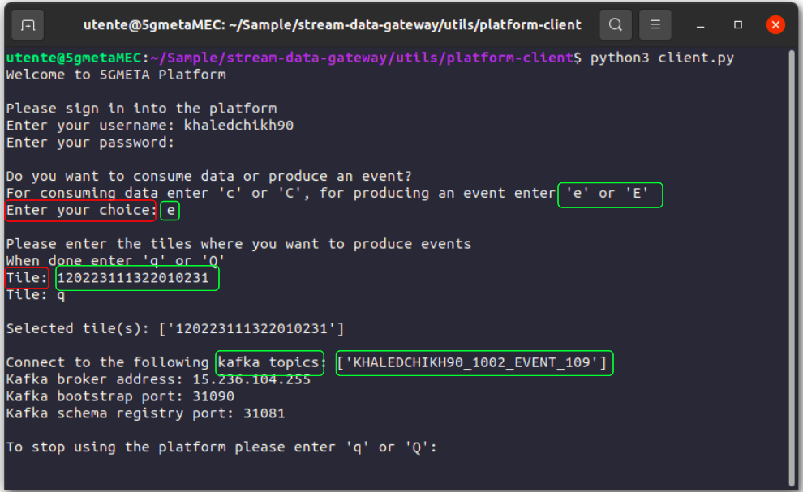
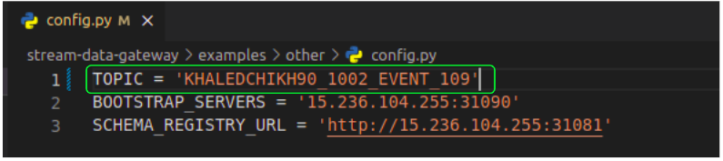
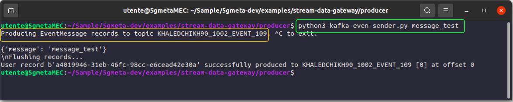

# Guide to produce an event

## Registering into the application

First step to start using 5GMETA platform will be registering on it.

Please go to [Registration web page](https://5gmeta-platform.eu/identity/realms/5gmeta/login-actions/registration?client_id=apisix&tab_id=gXKk2YPUybg) and fill the form with the data.


Once you have registered you will be able to access the platform and start producing events to 5GMETA platform. Next you will be guided with some instructions to get that purpouse.

## Software requirements

This guide is oriented to be executed in an Ubuntu 20.04 environment.

## Extra packages to be installed
First of all, you will need to install some dependencies (apt-get):

* python3-avro
* python3-confluent-kafka
* gstreamer1.0-plugins-bad (only if you are going to consume video)
* gstreamer1.0-libav (only if you are going to consume video)
* python3-gst-1.0 (only if you are going to consume video)

Also install with pip3:

* kafka-python
* numpy
* python-qpid-proton

## Platform-client helper application

There is a guided applicaction that will help you to get the apropriate parameters from 5GMETA platform to get the data you need.
You can execute it by downloading all content from folder: 

* [Platform cliente helper application](https://github.com/5gmetadmin/5gmeta-dev/tree/main/utils/platform-client/)

Once you have donwload that software you can run it by executing:
```
$ python3 client.py
```

in your command line.


### Client usage
Once you have executed the previous command you will be prompted for:

- 5GMETA username
- 5GMETA password
- Produce or Consume
- Tile


After entering your username/password, client will ask you if you want to:
- Consume data from 5GMETA platform
- Produce an event in a vehicle connected to 5GMETA platform


In our case we have decided to produce an event, so we push e. 

Inmediately client will prompt you which [tile](#tile) to push an event to.


The Client will prompt out a topic where you can push an event, copy paste it inside the config file


Execute in your terminal indicating the MESSAGE (EVENT) you want to push to 5GMETA platform as follow:
```
$ python3 kafka-even-sender.py MESSAGE
```
It will prompt you with the success of sending your event to 5GMETA platform with your indicated ***TOPIC*** from the client.



