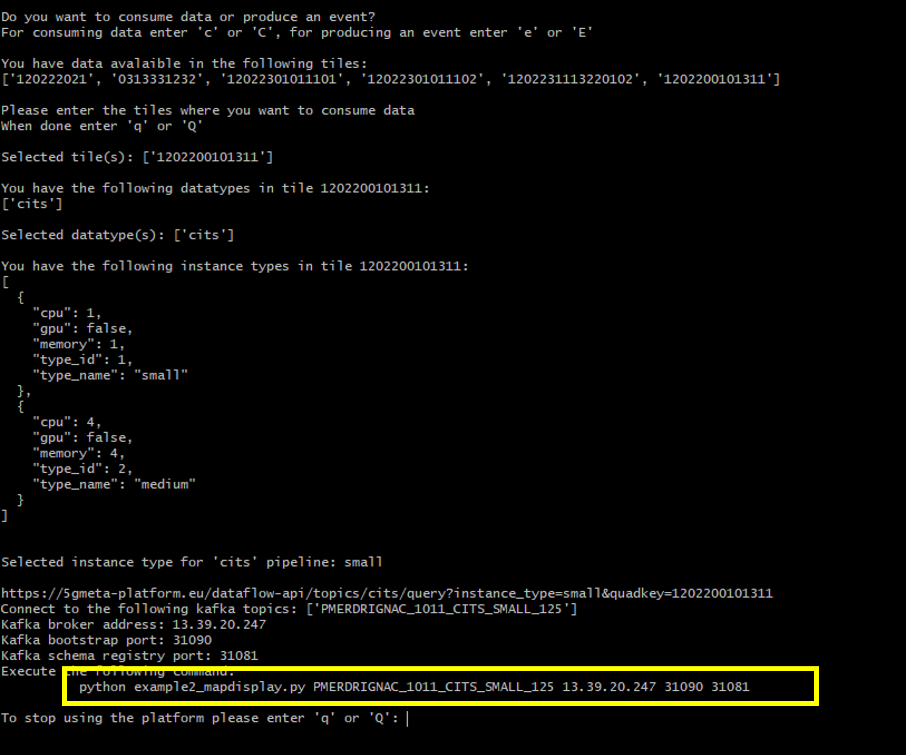

# Tutorial for processing data with 5GMETA platform

This folder intrudces basic example for the processing of data with 5GMETA platfrom

## Requirements

* python3
* folium (pip install folium)

## Example 1: Parallel processing of data consumed

In this example, we show how data can be consumed in a dedicated thread and a specific value (here, the speed of a vehicle) can be displayed in a GUI

First, you need to run the client platform (client_example1.py) to obtain the access to the data

 ```python client_example1.py```
 
 Upon the request, enter your credentials: (username, password)
 

 
 Once you have successfully registered, you can obtain a topic from which you can consume data.
 

 
 Please to not close the platform client script.

 Then, open a new terminal and run the script example1_oscilloscope.py using the command prompted in the platform client
 
 ```python example1_oscilloscope.py topic platformaddress bootstrap_port registry_port```
 
 You will start receive data and extract speed value to show in live in a GUI
 


## Example 2: Collection of location data with map display

In this example, we show how data can be collected from a given topic and location information is extracted and displayed using openstreetmap

First, you need to run the client platform (client_example2.py) to obtain the access to the data

 ```python client_example2.py```
 
 Upon the request, enter your credentials: (username, password)
 

 
 Once you have successfully registered, you can obtain a topic from which you can consume data.
 

 
 Please to not close the platform client script.

 Then, open a new terminal and run the script example2_displaymap.py using the command prompted in the platform client
 
 ```python example2_displaymap.py topic platformaddress bootstrap_port registry_port```
 
 You will start collecting a number of samples (e.g. 20) and store the location values in a dedicated table.
 At the end of the processing, a map file is generated to display the received location values. You can load the map file, 5GMETADataMap,html, in your browser to show the location values as illustrated in the figure below.
 


## Example 3: Produce a feedback event from consumption of data

In this example, we show how a feedback event can be generated to a specific tile after the processing of data consumed from 5GMETA platform.

First, you need to run the client platform (client_example3.py) to obtain the access to the data

 ```python client_example3.py```
 
 Upon the request, enter your credentials: (username, password)
 

 
 Once you have successfully registered, you will obtain the access to 2 topics: 1 for the consumption of data and 1 for the generation of an event feedback.
 

 
 Please to not close the platform client script.

 Then, open a new terminal and run the script example3_eventfeedback.py using the command prompted in the platform client
 
 ```python example3_eventfeedback.py consume_topic produce_topic platformaddress bootstrap_port registry_port```
 
 You will start consuming data using the consume topic (e.g. 5). After the consumption of a predefined number of message, an event is produced on the 5GMETA platform as illustrated in the figure below.
 
